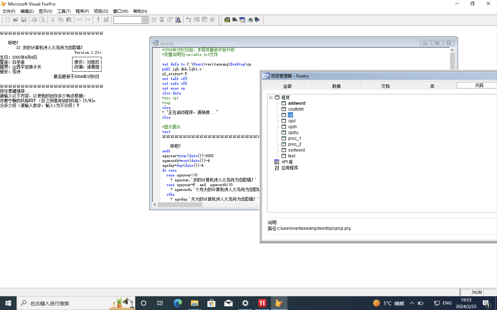

# 计算机诗人 火鸟

刘慈欣的作诗程序，来自未名BBS帖子 [大刘的计算机写诗程序写的诗](https://bbs.pku.edu.cn/v2/post-read.php?bid=210&threadid=14882047) 中站友 @Tariel 的分享。

## 使用

1. 在Windows电脑上安装 Visual FoxPro 9.0
2. 运行 `poetry.exe`
3. 或者用 Visual FoxPro 9.0 打开`poetry.pjx`, 使用 `set path to \path\to\cp` 设置工作目录到该文件夹, 在终端输入 `DO path\to\cp.prg` 运行

## 输出

你选择保存的诗会存到和其他文件一起的文件夹里。

# poet_firebird

Poetry machine program in FoxBase by Liu Cixin

## Usage

1. Install Visual FoxPro 9.0 on your windows device
2. Run `poetry.exe`
3. Or open `poetry.pjx` with Visual FoxPro 9.0, set the work directory to your path by `set path to \path\to\cp`, run by `DO path\to\cp.prg`

## Output

The poems that you preserved will be saved under the same directory as other files.
